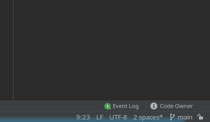
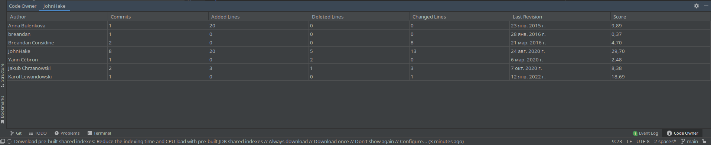
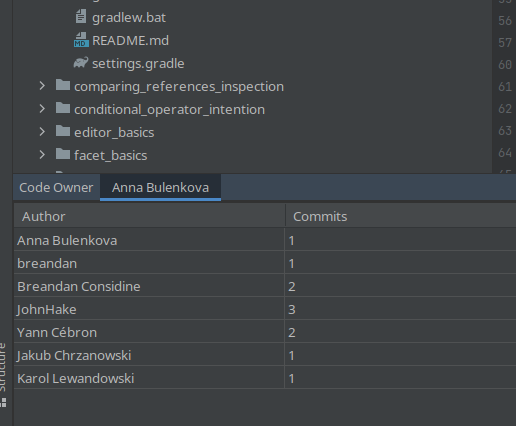
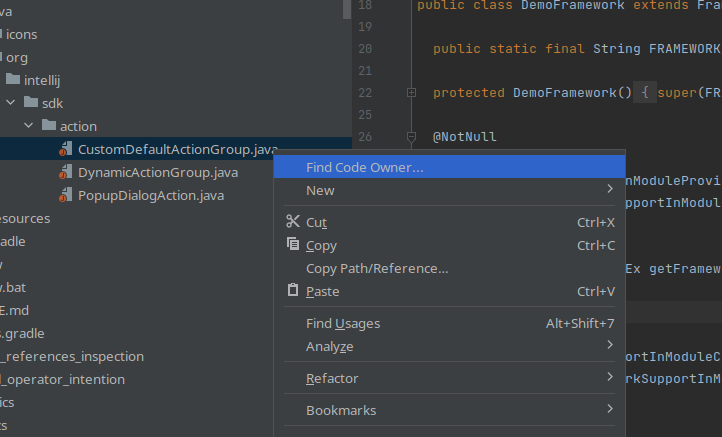

# Тестовое задание для участников JetBrains Bootcamp

Это тестовое задание предназначено для отбора участников летней стажировки 
для младшекурсников JetBrains Bootcamp. Ожидаемое время выполнения — 6–8 часов.
По всем вопросам, связанным с выполнением задания, можно обращаться к Виталию Брагилевскому 
(vitaly.bragilevsky@jetbrains.com, @bravit111 в телеграме).

## Задание

При работе с большими кодовыми базами часто удобно знать, кто лучше всех разбирается 
в содержимом конкретного файла. С одной стороны, это может быть человек, который 
написал в этом файле больше всего кода. С другой, особенно если файл существует 
достаточно давно, может случиться так, что исходный автор долго этого кода не касался
и уже мог всё забыть. Наверняка тот, кто с этим кодом работал недавно, но при этом
сделал достаточно значительный вклад, может дать более актуальную информацию. 
Будем называть такого человека владельцем кода (code owner).


## Алгоритм подсчета вклада

Прежде всего стоит обратить внимание на класс ```Estimator```, его интерфейс и реализация досконально описывают
процесс подсчета баллов на счет каждого из контрибьюторов:

1. Накапливается сумма по всем коммитам, при этом функцию оценки реализуют наследники ```Estimator```.
2. Затем очки нормализуются так, чтобы минимальный элемент был в промежутке от 1 до 2 баллов включительно.

В результате основным оценщиком является ```AverageEstimator```, который с подобранными (к сожалению, на маленьких данных) коэффициентами
использует все три функции оценки -- количество написанного кода, частоту ревизий в последнее время и количество кода, деленное на частоту ревизий

Понятно, что наиболее важными параметрами являются 1-ый и 2-ой, так как человек, написавший много кода и относительно недавно,
точно разбирается в коде, но 3-ий параметр позволяет набирать очки часто редактирующим код людям. 
Более того, для большой величины этого параметра нужно редактировать код очень часто, что невозможно с одноразовыми багофиксами.

## Пример использования плагина

1. При загрузке ```Intellij Idea``` c этим плагином его иконка появится справа в нижнем тулбаре:


2. Затем откроется панель инструментов:


3. Предсказанный владелец будет в названии вкладки:


4. После смены выбранного в эдиторе файла это окно будет отображать информацию для выбранного файла.
5. Еще его можно вызвать, кликнув правой кнопкой мыши по названию файла с кодом: 

